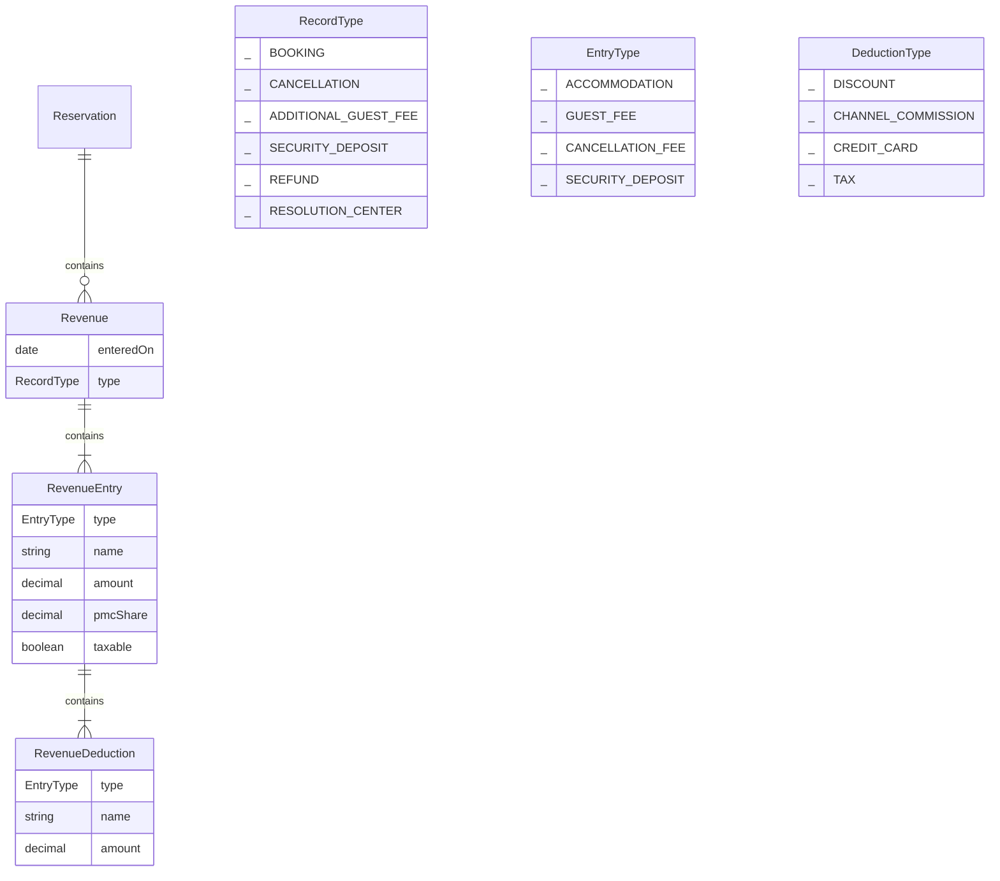

# 1. Reservation revenue model redesign

Date: 2023-10-16

## Status

Proposed

## Context

To support revenue reconciliation, we decided to take a look at the Reservation's Revenue model and associated data to allow for more granularity and flexibility. Addtionally, we want to make sure that the model that can handle financial modifications layered on top, such as cancellations and additional guest fees.

## Decision

The change that we're proposing or have agreed to implement.



## Consequences

The above model allows for simplicity when writing revenue records to the database. Entrys are part of a single atomic record and can be easily queried and aggregated. The model also allows for more flexibility in the future, e.g. when we want to add a new entry type.

## Plan

Given the scope of the changes, we will break apart the migration into multiple steps, building off the existing database tables. Below is how the existing tables will migrate to the above model:

| Old table  | New table           |
| ---------- | ------------------- |
| Revenue    | Revenue (no change) |
| RevenueFee | RevenueEntry        |
| RevenueTax | RevenueDeduction    |

But before renaming all the tables, we can migrate existing data to the new structures. The plan is focused on decomposing the following columns in the `Revenue` table into the new tables for entry and deductions.

- accommodation
- channelCommission
- discount

Following the migration, implementation of cancellation financials will be validation of the new structure, as it'd layer a second `Revenue` record that would reverse the original `Revenue` booking record's revenue.

### Accommodation revenue

- ✅ Add `type: EntryType` column to `RevenueFee` table
  - All existing records will be set to `EntryType.GUEST_FEE`
- ✅ The accommodation revenue will be moved into a new `RevenueFee` record

  - type = `EntryType.ACCOMMODATION`
  - value = `Revenue.accommodation`
  - pmcShare = `Revenue.pmcShare`
  - description = 'Accommodation revenue'
  - taxable = `true`

- ✅ The taxes associated with this accommodation revenue are directly attached to `Revenue` so they will be migrated by attaching them to the new `RevenueFee` record created in the previous step
- Cleanup and validation
  - Drop `RevenueTax.revenueId`, as it's no longer needed. The `RevenueTax` record will be connected to `RevenueFee` via `RevenueTax.revenueFeeId`
  - Drop `Revenue.accommodation`

### Channel commission

The channel commission is currently a single record that actually needs to be decomposed into separate `RevenueFee`/`RevenueDeduction` records for accommodation and guest fee revenue.

- ✅ Add `type: DeductionType` column to `RevenueTax` table
  - All existing records will be set to `DeductionType.TAX`
- Split the `channelCommission` into records associated with accommodation and guest fee revenue
  - `totalGrossRevenue` = accommodation revenue + guest fee revenue = sum of `RevenueFee.value` for given `Revenue`
  - Accommodation channel commission
    ```
    accommodationChannelCommission = channelCommission * (accommodationRevenue / totalGrossRevenue),
    ```
  - Guest fee channel commission
    ```
      guestFeeChannelCommission = channelCommission * (guestFeeRevenue / totalGrossRevenue),
    ```
- Cleanup and validation
  - Drop `Revenue.channelCommission`

### Discount

The discount is stored as a _percentage_ that only applies to the accommodation revenue. Like taxes and channel commissions, it'l be treated as a _deduction_.

- Add a new deduction associated with the `EntryType.ACCOMMODATION` for `Revenue` record
  - type = `DeductionType.DISCOUNT`
  - value = `accommodation amount * discount precentage`
  - pmcShare = `Revenue.pmcShare`
  - description = 'Accommodation discount'
- Cleanup and validation
  - Drop `Revenue.discount`

### Migrate all money columns to "Decimal" type

- Migrate all columns to `Decimal` type
  - Create new columns called `amount`
  - Migrate existing `value`s to `amount`
- Cleanup and validation
  - Drop old value columns

### Clean-up & other enhancements

- Rename tables
  - Create new tables and copy data over?
  - Drop old tables

### Cancellation financials

- Add a new `Revenue` record to represent the cancellation
  - Update `Reservation` to support multiple `Revenue` records
  - Add new `Revenue` record
    - type = `RecordType.CANCELLATION`
  - Add additional `RevenueFee` record that reverses the original booking's accommodation revenue
    - type = `EntryType.ACCOMMODATION`
  - Add additional `RevenueFee` records that reverse the orginal booking's guest fees
    - type = `EntryType.GUEST_FEE`
  - Add additional `RevenueTax` records that reverse the orginal booking's guest taxes and channel commissions
    - type = `DeductionType.TAX` and type = `DeductionType.CHANNEL_COMMISSION`

## Notes

_Oct 16, 2023_
: The name of the new models are subject to change, as we currently don't find them to be the most descriptive–as the names seems like they can be interchanged. As we work through the migration, we'll revisit the names and update this architecture decsion record accordingly. |
